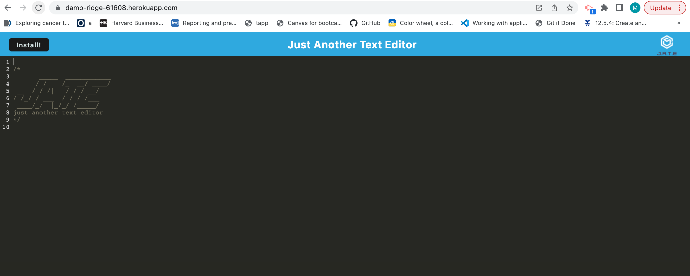

# Text-Editor
[](https://opensource.org/licenses/MIT)

  ## Description


  ## Table of Contents

  * [Description](#description)
  * [Installation](#installation)
  * [License](#license)
  * [Heroku-Link](#heroku-link)
  * [Questions](#questions)
  
  ## Installation

  To install this application you wiill need to run the following command:
  ```
   npm i
  
  ```
  
  ## License
  This project is covered under the MIT license.

  ## Heroku-Link
  Link for Heroku is here ()

    Example of the Heroku website
   


  ## Questions
  Please reach out to me at the below with any questions:
  
  * Email - mptheofield@gmail.com
  
  or visit my GitHub profile:
  
  * GitHub - [mtheofield](https://github.com/Mtheofield)