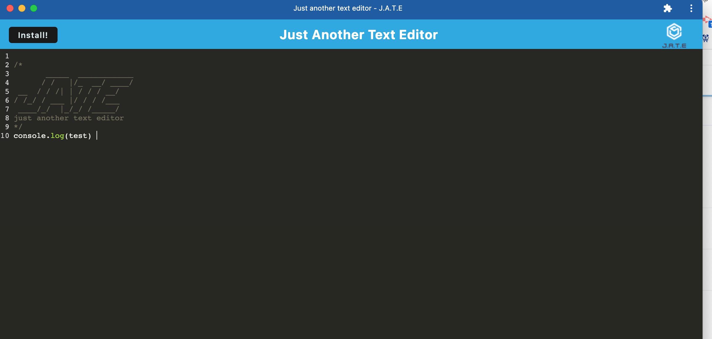

# Text-Editor

  ## Description
 The text editor allows a developer to create notes or code snippets with or without an internet connection and be able to reliably retrieve them for later use storing data to an IndexedDB database.

  ## Table of Contents

  * [Description](#description)
  * [Applications](#applications)
  * [License](#license)
  * [Heroku-Link](#heroku-link)
  * [Questions](#questions)
  
  ## Installation

 - [JavaScript] (https://www.javascript.com/)
 - [Node.js](https://nodejs.org/en/)
 - [Express](https://expressjs.com/)
 - [Webpack](https://webpack.js.org/)
 - [IndexedDB](https://developer.mozilla.org/en-US/docs/Web/API IndexedDB_API)
  
  ## License
  This project is covered under the MIT license.

  ## Heroku-Link
  Link for Heroku is here (https://damp-ridge-61608.herokuapp.com/)

    Example of the Heroku website
   
   
   

  ## Questions
  Please reach out to me at the below with any questions:
  
  * Email - mptheofield@gmail.com
  
  or visit my GitHub profile:
  
  * GitHub - [mtheofield](https://github.com/Mtheofield)